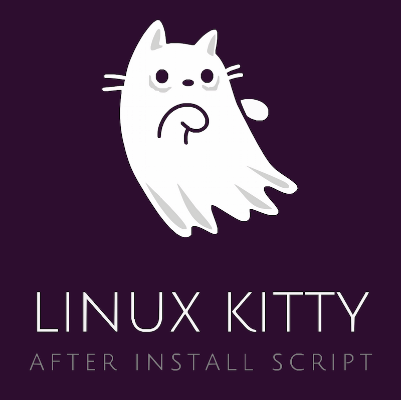

## Description

Script to install and configure software on a fresh install of Ubuntu-based Linux distro.

## Usage

```bash
curl -o- https://raw.githubusercontent.com/nvm-sh/nvm/v0.39.3/install.sh | bash && export NVM_DIR="$([ -z "${XDG_CONFIG_HOME-}" ] && printf %s "${HOME}/.nvm" || printf %s "${XDG_CONFIG_HOME}/nvm")" && [ -s "$NVM_DIR/nvm.sh" ] && \. "$NVM_DIR/nvm.sh" && nvm install --lts && nvm use --lts && npm install -g zx && chmod +x linux-kitty.mjs && linux-kitty.mjs
```